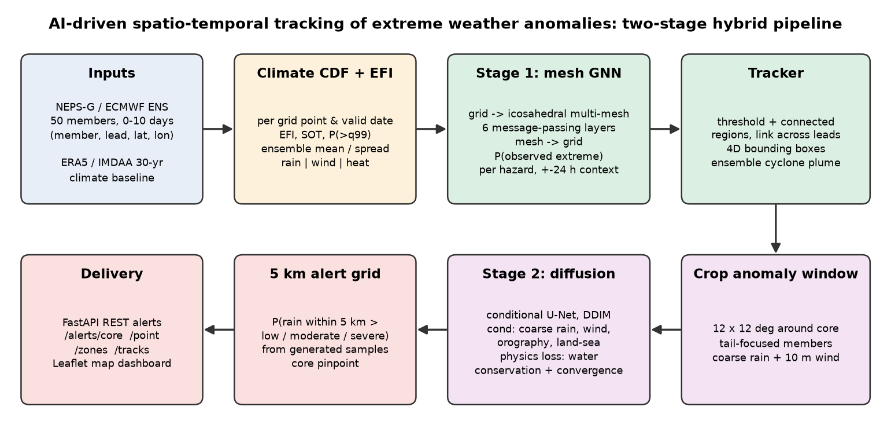
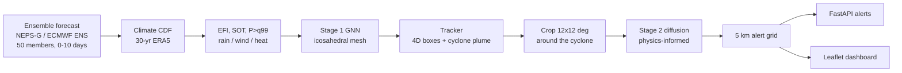
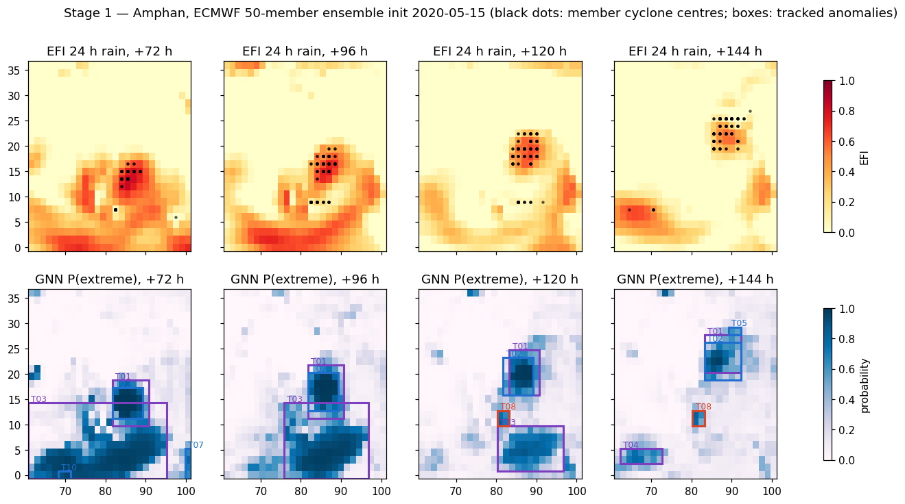
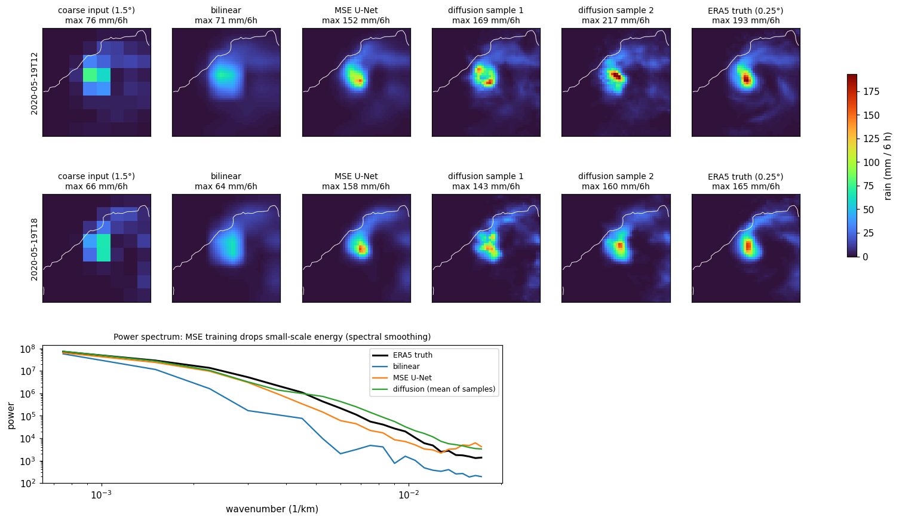
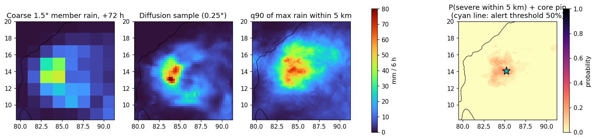

# SIH 2026 presentation reference

**Team:** Stealth Choppers · **Category:** Software
**Problem statement:** AI-Driven Spatio-Temporal Tracking of Extreme Weather Anomalies in Medium-Range Forecasts

This file is the single source for building the SIH idea deck. Every number here was re-checked
on 28 Sep 2026 by running `python run_demo.py`, `pytest` and the API smoke test on Windows 11 with
Python 3.12. The team's current deck is next to this file:
[`SIH2026-IDEA-Presentation-Format.pptx`](SIH2026-IDEA-Presentation-Format.pptx).

Contents

1. [SIH rules for the deck](#1-sih-rules-for-the-deck)
2. [Fix these in the current deck first](#2-fix-these-in-the-current-deck-first)
3. [Slide-by-slide content](#3-slide-by-slide-content)
4. [Complete tech stack](#4-complete-tech-stack)
5. [Architecture and pipeline](#5-architecture-and-pipeline)
6. [Verified results](#6-verified-results)
7. [Figures you can use](#7-figures-you-can-use)
8. [Live demo script](#8-live-demo-script)
9. [Judge questions and honest answers](#9-judge-questions-and-honest-answers)
10. [Limitations and roadmap](#10-limitations-and-roadmap)
11. [Where every number comes from](#11-where-every-number-comes-from)

---

## 1. SIH rules for the deck

From the template's instruction slide:

* At most **6 slides including the title slide**.
* Points, diagrams, infographics and pictures, not paragraphs.
* Use the provided template and keep its section headings.
* Export to **PDF** and upload that. PPT, Word and other formats are rejected.
* Delete the instruction slide (slide 7) before exporting.

## 2. Fix these in the current deck first

The deck was written against an older build. These lines no longer match the prototype.

| Slide | Current text | Replace with | Why |
|---|---|---|---|
| 1 | Problem Statement ID, Theme, Team ID are blank | Fill in from the SIH portal | Required fields |
| 2 | "Held-out Cyclone Amphan tracked 5.5 days ahead; landfall alert core over south Bengal" | "Held-out Cyclone Amphan tracked from genesis to landfall in a forecast issued about 5.5 days ahead; moderate rain alerts at +48 h and +72 h" | The alert core is now at sea (14.05N 85.20E on 18 May), not over south Bengal |
| 2 | "Diffusion keeps 98% of peak rain vs 84% for MSE U-Net" and the "98% peak rain kept" callout | "Diffusion keeps 101% of peak rain vs 84% for MSE U-Net", callout "101%" | Current metrics file |
| 2 | Stage 1 figure | Replace with the new [`outputs/stage1_tracking.png`](../../outputs/stage1_tracking.png) | The old figure shows Amphan's wind box merged with the monsoon band; the tracker now separates the cyclone |
| 3 | "Language: Python 3.11" | "Language: Python 3.10 to 3.12" | Tested on 3.10 and 3.12 |
| 3 | (missing) | Add "Testing: pytest, 22 unit tests + API smoke test" | Shows engineering quality |
| 4 | "~1 min on a laptop CPU" | "about 3 to 5 min on a laptop CPU" | Measured 2.8 and 4.4 min |
| 4 | Table: Bilinear 41% / 63%, diffusion 98% | Bilinear 44% / 64%, diffusion 101% | Current metrics file |
| 5 | "~1 min full run on a laptop CPU" | "3 to 5 min" | Same as above |
| 5 | "5 km alert resolution" | "5 km alert grid" | The grid is resampled from 0.25° (about 28 km) downscaled fields; see Q&A |
| 5 | "e.g. Kolkata at Amphan landfall" | "any town or village with one API call" | The 15 May forecast gives Kolkata "none" at landfall time (P(low) 33%); don't imply it warned Kolkata |
| 7 | Instruction slide | Delete | SIH rule |

## 3. Slide-by-slide content

### Slide 1: Title

* Problem Statement ID: *(from portal)*
* Problem Statement Title: AI-Driven Spatio-Temporal Tracking of Extreme Weather Anomalies in Medium-Range Forecasts
* Theme: *(from portal)*
* PS Category: Software
* Team ID: *(from portal)*
* Team Name: Stealth Choppers

### Slide 2: Proposed solution

**One-line pitch:** a two-stage hybrid AI pipeline that turns a 50-member, 10-day ensemble forecast
into tracked extreme-weather objects and 5 km-grid rain alerts, on a laptop CPU.

* **Stage 1:** Extreme Forecast Index (EFI) against a 30-year ERA5 climate, then a graph neural
  network on an icosahedral mesh gives P(extreme) for heavy rain, damaging wind and extreme heat.
* **Tracker:** draws a 4D bounding box (a lat/lon box at every 6-hourly lead) around each moving
  anomaly, splits a cyclone from the monsoon band around it, and plots every member's cyclone centre.
* **Stage 2:** physics-informed diffusion downscales the worst anomaly and issues low / moderate /
  severe rain alerts on a 5 km grid.

How it addresses the problem

* Replaces manually scanning 50 members × 41 lead times × 3 hazards with one tracked, calibrated product.
* Held-out Cyclone Amphan: tracked from genesis to landfall in the 15 May 2020 forecast, about 5.5 days before landfall.

Innovation and uniqueness

* Mesh GNN beats the raw EFI: heavy-rain AUC 0.955 vs 0.896 on Amphan; wins 7 of 7 events for wind.
* Diffusion keeps 101% of the peak rain where an MSE-trained U-Net keeps 84%; water conserved within 4%.
* Probabilistic alerts with an error bar on every probability.

Stat callouts: **5.5 days** tracked before landfall · **0.955** heavy-rain AUC · **101%** peak rain kept

Figure: [`outputs/stage1_tracking.png`](../../outputs/stage1_tracking.png)
Caption: "Cyclone Amphan, ECMWF 50-member ensemble initialised 15 May 2020: EFI (top) and GNN P(extreme) with tracked boxes (bottom). Black dots are member cyclone centres."

### Slide 3: Technical approach

Technologies (short form for the slide; full table in [section 4](#4-complete-tech-stack))

* Language: Python 3.10 to 3.12
* AI / ML: PyTorch; mesh GNN with scatter-op message passing (247k parameters); conditional U-Net diffusion, DDPM training with DDIM sampling (2.2M parameters)
* Data: xarray + Dask; NetCDF, Zarr, GRIB2 (cfgrib)
* Inputs: ECMWF ENS 50 members (NEPS-G ready); ERA5 1990 to 2019 climate via WeatherBench 2
* Serving: FastAPI + Uvicorn REST API with OpenAPI docs
* Map: Leaflet dashboard built with Folium
* Testing: pytest, 22 unit tests + API smoke test
* Hardware: laptop CPU, no GPU

Methodology

1. **Climate CDF:** 101 quantiles per grid point from 30 years of ERA5, ±15 days, same hour.
2. **Features:** EFI, Shift of Tails, standardised mean and spread, P(>q99), P(<q1) for rain, wind, heat, with ±24 h context.
3. **Stage 1 GNN:** grid → icosahedral multi-mesh → 6 message-passing layers → grid, giving P(observed extreme) per hazard.
4. **Tracker:** threshold, connected regions, split around tropical lows, link across 6-hourly leads, member cyclone plume.
5. **Stage 2:** 12° × 12° crop around the cyclone, 24 importance-weighted members × 2 diffusion samples, 30-step DDIM with water-conservation and moisture-convergence loss.
6. **Alerts:** P(max rain within 5 km ≥ threshold) on a 5 km grid; a level is issued at P ≥ 50%.

Figure: [`docs/architecture.png`](../architecture.png)

### Slide 4: Feasibility and viability

Feasibility

* Working prototype: one command runs the full pipeline on real Amphan data in about 3 to 5 min on a laptop CPU.
* Cheap to retrain: about 5 min for Stage 1 and 30 to 60 min for Stage 2, no GPU.
* Plug-in ready: one loader maps NEPS-G, NCUM, ECMWF and IMDAA files to the same layout.
* Tested: 22 unit tests, an API smoke test, and a tracker check on all 7 events.

Viability

* Skill on the held-out cyclone: AUC 0.955 rain, 0.952 wind.
* Hold-one-out over 7 events: mean AUC 0.92 rain, 0.91 wind; the GNN beats the EFI on wind in 7 of 7.
* Tracker finds all 5 cyclones with fixed settings and raises no false storm on the heatwave or quiet cases.
* Easy to operate: a REST service that reruns after each ensemble cycle.

Challenges and strategies

* No open 5 km truth for India → the code trains on any coarse/fine pair, e.g. NEPS-G 12 km with IMDAA-R 4 km.
* Small training set (6 cases) → scale up with the NCMRWF archive; heat skill (AUC 0.84) needs more heatwaves.
* Downscaler trained on reanalysis, applied to forecasts → retrain on forecast / observed-rain pairs.
* No internet at the venue → fully offline synthetic mode with identical file formats.

Downscaling table for the slide

| Method | Peak kept | 99th pct | Water error |
|---|---|---|---|
| Bilinear | 44% | 64% | 22% |
| MSE U-Net | 84% | 91% | 11% |
| Physics-informed diffusion | 101% | 97% | 4% |

Figure: [`outputs/stage2_downscaling_comparison.png`](../../outputs/stage2_downscaling_comparison.png)

### Slide 5: Impact and benefits

Target audience

* **Forecasters (IMD, NCMRWF):** one tracked, calibrated view of extremes instead of scanning 50 members by hand.
* **Disaster managers (NDMA, SDMAs):** 4D tracks days ahead to pre-position teams and plan evacuations.
* **District officials:** point alerts for any town or village with one API call.

Stat callouts: **5.5 days** early tracking, Amphan · **5 km** alert grid · **3 hazards** rain, wind, heat · **3 to 5 min** full run on a laptop CPU

Benefits

* **Social:** earlier, location-specific warnings for coastal and flood-prone communities.
* **Economic:** lead time to protect crops, fishing fleets and property; runs on existing CPUs with no GPU cost.
* **Environmental:** far less compute and energy than rerunning high-resolution NWP; supports climate-resilience planning.

Figure option: [`outputs/stage2_forecast_alerts.png`](../../outputs/stage2_forecast_alerts.png) (downscaled rain and P(severe) with the alert pin)

### Slide 6: Research and references

The current list on slide 6 is accurate. Keep it. Two optional additions for methods the code uses:

* Nichol, A. & Dhariwal, P. (2021). Improved denoising diffusion probabilistic models (cosine noise schedule). ICML
* Ronneberger, O. et al. (2015). U-Net: convolutional networks for biomedical image segmentation. MICCAI

## 4. Complete tech stack

### Software

| Layer | Technology | Version | What it does here |
|---|---|---|---|
| Language | Python | 3.10 to 3.12 | Everything |
| Deep learning | PyTorch (CPU build) | 2.14.0 | Mesh GNN, diffusion U-Net, MSE baseline |
| Numerics | NumPy | 1.26.4 | EFI integral, weighted probabilities |
| Scientific | SciPy | 1.15.3 | Connected-region labelling (`ndimage`), mesh neighbour search (`cKDTree`), interpolation to the 5 km grid |
| Time series | pandas | 2.3.3 | Valid times, climatology windows |
| Gridded data | xarray | 2025.6.1 | Labelled (member, lead, lat, lon) arrays |
| Parallel I/O | Dask | 2026.8.0 | Lazy, chunked reads of large archives |
| File formats | netCDF4 1.7.4, Zarr 2.18.3, cfgrib + eccodes (optional) | | Local cache, cloud archive, GRIB2 for NEPS-G / NCUM |
| Cloud access | fsspec 2026.9.0, aiohttp 3.14.3, requests 2.34.2 | | Anonymous HTTPS streaming from WeatherBench 2 on Google Cloud |
| API | FastAPI | 0.141.1 | REST alert service with auto-generated OpenAPI docs |
| Web server | Uvicorn | 0.54.0 | Serves the API and dashboard |
| Map | Folium (Leaflet.js) | 0.20.0 | Interactive dashboard, time slider, layer control; OpenStreetMap and OpenTopoMap tiles |
| Figures | Matplotlib | 3.10.9 | Slide figures; contours converted to GeoJSON alert polygons |
| Testing | pytest 9.1.1, httpx 0.28.1 | | 22 unit tests, FastAPI test client |
| Hardware | 4-core laptop CPU | | No GPU needed |
| OS | Windows 11, Linux | | Tested on Windows 11 with Python 3.12 |

### Models

| Model | Architecture | Size | Training |
|---|---|---|---|
| Stage 1 mesh GNN | Encode-process-decode (GraphCast style). Grid → mesh bipartite encoder, 6 interaction-network layers on an icosahedral multi-mesh (refinement level 5, 430 regional nodes, 3,128 edges), mesh → grid decoder. Hidden size 64. 57 inputs per grid point: 6 statistics × 3 variables × 3 times (t−24 h, t, t+24 h) plus latitude, longitude and lead time | 247k parameters | 6 events, 30 epochs, AdamW with cosine learning rate, class-weighted binary cross-entropy. About 5 min on CPU |
| Stage 2 diffusion | Conditional U-Net (channels 32/64/128, residual blocks, GroupNorm, sinusoidal time embedding). v-prediction, cosine noise schedule, 200 training steps, 30-step DDIM sampling. Inputs: noisy field + coarse rain, 10 m u and v wind, orography, land-sea mask | 2.22M parameters | 240 ERA5 0.25° fields (2010 to 2019, Apr to Nov), 3,000 steps, batch 24, AdamW with one-cycle schedule. Loss = v-MSE + water conservation + moisture convergence. 30 to 60 min on CPU |
| MSE U-Net baseline | Same U-Net, direct regression | 2.22M parameters | 1,500 steps, plain MSE |
| Ablation | Diffusion without the physics loss | 2.22M parameters | Same as Stage 2 with physics weights set to 0 |

### Algorithms

| Step | Method |
|---|---|
| Extreme signal | EFI (Lalaurette 2003), Shift of Tails (Zsótér 2006), P(>q99), P(<q1), standardised mean and spread |
| Mesh | Recursively refined icosahedron; edges from every level merged into one multi-mesh |
| Tracking | Threshold at P ≥ 0.5, 8-connected regions, split within 600 km of a tropical low, nearest-centroid linking with a 700 km gate |
| Tropical low | Ensemble-mean MSLP local minimum ≥ 3 hPa below surroundings with ≥ 9 m/s wind nearby |
| Cyclone plume | Each member's MSLP minimum near the track; strike fraction = share of members with a closed low |
| Member selection | Importance sampling: 12 wettest members + 12 spread through the rest, weighted to represent all 50 |
| Alert probability | Weighted share of samples whose max rain within 5 km exceeds the threshold, with a Monte Carlo standard error |
| Headline rule | Lead with the highest P(severe); ties within one standard error go to the earliest lead |
| Alert zones | Filled contours at P ≥ 50% exported as GeoJSON polygons |

### Data

| Dataset | Resolution | Period | Use |
|---|---|---|---|
| ECMWF IFS ensemble (WeatherBench 2) | 1.5°, 50 members, 0 to 240 h every 6 h | 7 initialisations, 2018 to 2021 | Stage 1 input; Stage 2 forecast input |
| ERA5 (WeatherBench 2) | 1.5° | 1990 to 2019, day of year 100 to 190 | 30-year climatology for the EFI |
| ERA5 | 1.5° | Forecast valid times | Labels: did the real weather exceed its 99th percentile |
| ERA5 | 0.25° | 240 random 6-hourly fields, 2010 to 2019 | Stage 2 training |
| ERA5 | 0.25° | 18 to 22 May 2020, 17 time steps | Stage 2 held-out test |
| ERA5 static | 0.25° | | Orography, land-sea mask |

Domains: Stage 1 covers 0 to 36N, 60 to 100.5E (25 × 27 points at 1.5°). Stage 2 covers 5 to 30N, 70 to 100E (101 × 121 points at 0.25°).

Events: Fani (27 Apr 2019), 2019 north-India heatwave (28 May 2019), Vayu (9 Jun 2019), Tauktae (12 May 2021), Yaas (21 May 2021), quiet period (2 May 2018), and **Amphan (15 May 2020, held out for testing)**.

Alert thresholds (IMD daily classes scaled to 6 hours): low ≥ 16, moderate ≥ 29, severe ≥ 51 mm per 6 h, within 5 km, issued when P ≥ 50%.

### API endpoints

| Endpoint | Returns |
|---|---|
| `GET /health` | Service status, event, number of tracks, downscaled leads |
| `GET /tracks` | Every tracked anomaly with its 4D envelope |
| `GET /tracks/{id}` | One track, step by step, with its cyclone plume |
| `GET /alerts/core` | Headline alert pin and 5 km impact circle (GeoJSON) |
| `GET /alerts/first-warning` | Earliest lead that reaches any alert level |
| `GET /alerts/point?lat=&lon=&lead_hours=` | Alert level and probabilities for any location |
| `GET /alerts/zones?p_min=` | Low / moderate / severe polygons (GeoJSON) |
| `GET /dashboard` | The Leaflet map |
| `GET /docs` | Interactive API documentation |

### Codebase

About 2,900 lines of Python (2,300 in the `sih` package), 22 unit tests, MIT licence.

```
run_demo.py               one-command pipeline
sih/config.py             domain, events, thresholds, model sizes
sih/data/                 loader (NetCDF/GRIB2/Zarr), ERA5 + ECMWF fetcher, synthetic generator
sih/stage1/               efi.py, mesh.py, gnn.py, pipeline.py, tracker.py
sih/stage2/               unet.py, diffusion.py (DDPM + physics loss), pipeline.py
sih/products.py           tracks -> downscaling -> 5 km alert grid
sih/api/app.py            FastAPI alert service
sih/dashboard/build.py    Leaflet dashboard + figures
scripts/                  cross-validation, physics ablation, tracker check, API smoke test
tests/                    unit tests
data/cache/era5/          bundled Amphan data (about 31 MB)
models/                   trained weights (about 46 MB)
outputs/                  products, figures, dashboard, metrics
docs/presentation/        this guide and the team's SIH deck
```

## 5. Architecture and pipeline





## 6. Verified results

### Stage 1: detecting extremes (area under the ROC curve, 1.0 perfect, 0.5 chance)

Held-out Amphan:

| Hazard | GNN | Raw EFI |
|---|---|---|
| Heavy rain | **0.955** | 0.896 |
| Damaging wind | **0.952** | 0.939 |
| Extreme heat | 0.841 | **0.854** |

Hold-one-out over all 7 events:

| Hazard | GNN mean | EFI mean | Events where GNN wins | Day 6 to 10: GNN vs EFI |
|---|---|---|---|---|
| Heavy rain | **0.92** | 0.88 | 4 of 7 | **0.85** vs 0.81 |
| Damaging wind | **0.91** | 0.86 | 7 of 7 | **0.84** vs 0.77 |
| Extreme heat | 0.85 | 0.84 | 5 of 7 | 0.79 vs 0.78 |

### Tracking Amphan (forecast initialised 15 May 2020, 00 UTC)

* Cyclone wind track +24 to +156 h and rain track +24 to +150 h, per-step boxes 6° to 9° across.
* The monsoon wind surge south of the storm is a separate track, not part of the cyclone box.
* Ensemble-mean cyclone centre:

| Lead | Centre | Pressure | Members with a closed low |
|---|---|---|---|
| +48 h | 12.4N 85.8E | 993 hPa | 100% |
| +72 h | 14.4N 85.4E | 985 hPa | 100% |
| +96 h | 16.7N 86.0E | 980 hPa | 100% |
| +120 h | 19.4N 87.2E | 980 hPa | 100% |
| +144 h | 22.7N 88.1E | 989 hPa | 96% |

Actual landfall: near Sagar Island (21.6N 88.3E) on 20 May, about +130 h.

### Tracker check on all 7 events (settings fixed on Amphan)

| Event | Cyclone followed | Result |
|---|---|---|
| Fani | Yes | Correct path to Puri landfall |
| Vayu | Yes | Correct path, turns west off Gujarat |
| Tauktae | Yes | 250 to 400 km west of the real track from day 5 (forecast error) |
| Yaas | Yes | Correct path to Balasore |
| Amphan | Yes | Correct path to Sagar Island |
| 2019 heatwave | No cyclone | No false storm |
| Quiet 2018 | No cyclone | No false storm |

### Alerts from the 15 May forecast (24 importance-weighted members, 5 km radius)

| Lead | Valid (UTC) | Core | P(low / moderate / severe) | Level |
|---|---|---|---|---|
| +24 h | 16 May 00:00 | 9.14N 84.07E | 33% / 7% / 3% | none |
| +48 h (earliest warning) | 17 May 00:00 | 12.48N 84.86E | 91% / 52% / 7% | moderate |
| **+72 h (headline)** | 18 May 00:00 | 14.05N 85.20E | 70% / 51% / 27% (±7 / ±8 / ±7) | **moderate** |
| +102 h | 19 May 06:00 | 16.69N 85.22E | 47% / 30% / 21% | none |
| +126 h | 20 May 06:00 | 19.78N 85.95E | 36% / 25% / 18% | none |
| +150 h | 21 May 06:00 | 24.26N 86.58E | 14% / 13% / 13% | none |

The headline "moderate" rests on P(moderate) = 51%, right at the 50% line. Present it as "moderate, borderline".

### Stage 2: downscaling test on 17 Amphan time steps (ERA5 0.25° truth)

| Method | Peak kept | 99th pct | RMSE (mm/6 h) | CRPS (mm/6 h) | Water-mass error |
|---|---|---|---|---|---|
| Bilinear interpolation | 44% | 64% | 6.2 | 2.39 | 22% |
| U-Net trained with MSE | 84% | 91% | **4.4** | 1.70 | 11% |
| Diffusion, no physics loss | 110% | 94% | 6.0 | **1.40** | 8% |
| **Physics-informed diffusion** | **101%** | **97%** | 5.7 | **1.40** | **4%** |
| ERA5 truth | 100% | 100% | 0 | 0 | 0% |

* The MSE U-Net has the lowest RMSE because it blurs toward the average, which is the spectral smoothing problem.
* On CRPS, the proper score for probabilistic forecasts, diffusion is best.
* Switching off the physics loss doubles the water-mass error (4% → 8%) and makes peaks overshoot (110%).

### Engineering checks

| Check | Result |
|---|---|
| Unit tests | 22 passed |
| API smoke test | All endpoints return 200 |
| Full demo run | 2.8 to 4.4 min on a laptop CPU |

## 7. Figures you can use

| File | Shows | Best slide |
|---|---|---|
| [`outputs/stage1_tracking.png`](../../outputs/stage1_tracking.png) | EFI and GNN probability with tracked boxes and member cyclone centres | 2 |
| [`docs/architecture.png`](../architecture.png) | Two-stage pipeline diagram | 3 |
| [`outputs/stage2_downscaling_comparison.png`](../../outputs/stage2_downscaling_comparison.png) | Coarse, bilinear, MSE U-Net, diffusion and truth, plus power spectrum | 4 |
| [`outputs/stage2_forecast_alerts.png`](../../outputs/stage2_forecast_alerts.png) | Downscaled rain, 90th percentile rain, P(severe) with the alert pin | 5 |
| [`outputs/dashboard.html`](../../outputs/dashboard.html) | Interactive map; take a screenshot for a slide | 5 |





## 8. Live demo script

Setup (once, Windows PowerShell):

```powershell
git clone https://github.com/omgawande1523/SIH-NEW.git D:\sih-prototype
cd D:\sih-prototype
py -3.12 -m venv .venv
.\.venv\Scripts\Activate.ps1
python -m pip install -r requirements.txt
```

The repo already contains the outputs of a full run, so for a quick demo you can start the API
straight away. To show the pipeline running, use `python run_demo.py` first (3 to 5 min).

```powershell
uvicorn sih.api.app:app --port 8000
```

If port 8000 is taken (for example by WSL), use `--port 8001` and change the links below.

Demo flow:

1. Open `http://localhost:8000/dashboard`. Turn on the tracks, press play on the time slider, show the boxes following Amphan north, then turn on the alert zones.
2. Open `http://localhost:8000/docs`. Run `/alerts/core` (headline pin), then `/alerts/first-warning`.
3. Run `/alerts/point` with `lat=22.57`, `lon=88.36`, `lead_hours=126` to show a point query for Kolkata. It returns "none" (P(low) 33%, 398 km from the core), which shows the system does not over-warn 5 days out.

## 9. Judge questions and honest answers

**Why not just use the ECMWF EFI?**
The GNN beats the raw EFI at detecting real extremes, most at day 6 to 10 and for wind, where it wins in 7 of 7 events.

**Is the 5 km resolution real?**
The alert grid is 5 km, resampled from the 0.25° (about 28 km) downscaled fields, because no open 5 km truth exists for India. The same code trained on NEPS-G 12 km and IMDAA-R 4 km would give genuine kilometre-scale output.

**Amphan was a super cyclone. Why is the headline only "moderate"?**
This forecast was issued 5 days before landfall, when the ensemble still disagreed on where the heaviest rain would fall. At that range no single 5 km point reaches 50%, and an honest probabilistic system should say so. Operationally it reruns with every new ensemble, and alerts should sharpen as the storm approaches. That has not yet been tested on later forecasts.

**How was it validated?**
Hold-one-out cross-validation over 7 events for Stage 1, a held-out downscaling test on 17 Amphan time steps for Stage 2, a physics-loss ablation, and a tracker check on all 7 events.

**Why diffusion rather than a normal CNN?**
A CNN trained with MSE averages over possible outcomes and loses the peaks (84% kept). Diffusion samples realistic fields, keeps the full peak (101%), and its samples form an ensemble that scores best on CRPS.

**Why a GNN on an icosahedral mesh?**
It avoids the distortion of a lat-lon grid and lets messages travel thousands of kilometres in one hop, the same design as Google DeepMind's GraphCast.

**Does it run in real time?**
Not yet. It runs on archived forecasts. The loader already reads NEPS-G, NCUM and IMDAA formats, so a live NCMRWF feed is the next step.

**Does it work all year?**
The current climate baseline covers April to early July, matching the training events. A full-year baseline is a configuration change plus a larger download.

**Who would use it?**
IMD and NCMRWF forecasters, and NDMA / SDMA disaster managers, as decision support. Official public warnings remain IMD's responsibility.

## 10. Limitations and roadmap

Current limitations

* Seven training events, all April to June; monsoon depressions, western disturbances and cold waves are untested.
* The climate baseline covers only mid-April to early July.
* The downscaler was trained on smoothed reanalysis and applied to forecasts, so it has not learned forecast errors.
* Alert probabilities have not been checked against rain gauges.
* It runs on one archived case, not a live feed.
* The API has no login, HTTPS or monitoring, and serves one forecast at a time.
* The moisture-convergence part of the physics loss shows no measurable effect yet.

Roadmap

1. Connect a real-time NEPS-G feed from NCMRWF and build a full-year climate baseline.
2. Retrain the downscaler on forecast and observed-rain pairs, for example NEPS-G against IMD gridded rainfall.
3. Verify over several years and all seasons, including reliability against gauges.
4. Run alongside IMD for a season before anyone acts on the output.
5. Harden the service: login, monitoring, scheduled runs, and a versioned record of each forecast.

## 11. Where every number comes from

| Number | File |
|---|---|
| Amphan AUCs | [`outputs/stage1_metrics.json`](../../outputs/stage1_metrics.json) |
| Hold-one-out AUCs | [`outputs/stage1_crossval.json`](../../outputs/stage1_crossval.json) |
| Downscaling scores | [`outputs/stage2_metrics.json`](../../outputs/stage2_metrics.json) |
| Tracks, cyclone centres, alert cores | [`outputs/products.json`](../../outputs/products.json) |
| Tracker check on 7 events | [`outputs/tracker_check.json`](../../outputs/tracker_check.json) |
| Model sizes, mesh size | Counted from the trained weights in [`models/era5/`](../../models/era5) |
| Versions | [`requirements.txt`](../../requirements.txt) |
| Settings and thresholds | [`sih/config.py`](../../sih/config.py), [`sih/stage1/tracker.py`](../../sih/stage1/tracker.py) |

To regenerate every output: `python run_demo.py`. To rerun the checks: `python -m pytest -q tests` and `python scripts/smoke_test_api.py`.
